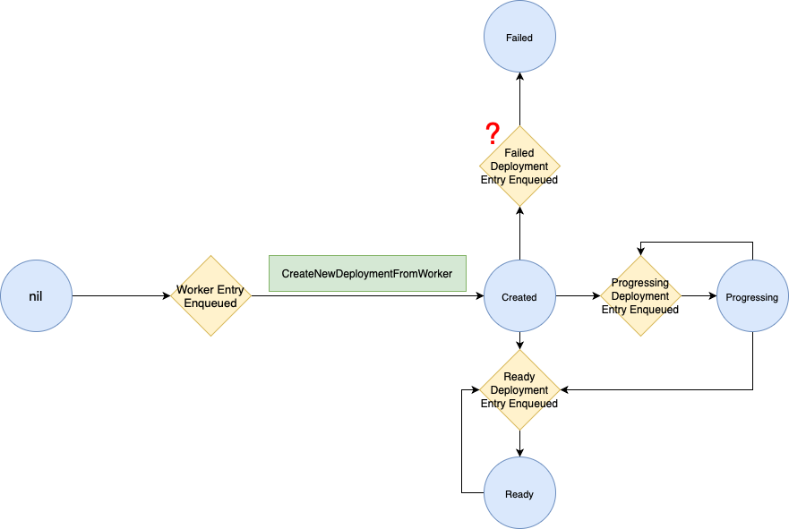

# k8s-controller
An implementation of a simple k8s controller:
1. Create custom resource
2. Launch a RPC worker pod with specific memory, cpu and concurrency limit

## Generate K8S code
```bash
docker build -t code-gen .
docker run -it --rm -v `pwd`:/go/src/github.com/willeslau/k8s-controller code-gen bash

# inside docker
/go/src/k8s.io/code-generator/generate-groups.sh all \
github.com/willeslau/k8s-controller/pkg/client \
github.com/willeslau/k8s-controller/pkg/apis \
worker:v1
```
K8S generated code should be populated.

## Write the controller
The code is in `internal/controller`, the state machine (work in progress) is 


## Launch the controller
Get the master location by `kubectl cluster-info`
```bash
./controller --kubeconfig ~/.kube/config --master https://192.168.1.88:6443
```

## Lessions from Deployment-Controller
1. New status is derived only based on current deployment and all the replicas sets,
        but not the "past" states.

## Good References:
1. Replica Controller: https://blog.csdn.net/yan234280533/article/details/78312620
2. Deployment Controller: https://blog.hdls.me/15763918313590.html
3. Deployment Controller Src: https://github.com/kubernetes/kubernetes/blob/27aca3f7c2f06925dd1890cd8b0522b775b0e323/pkg/controller/deployment/deployment_controller.go